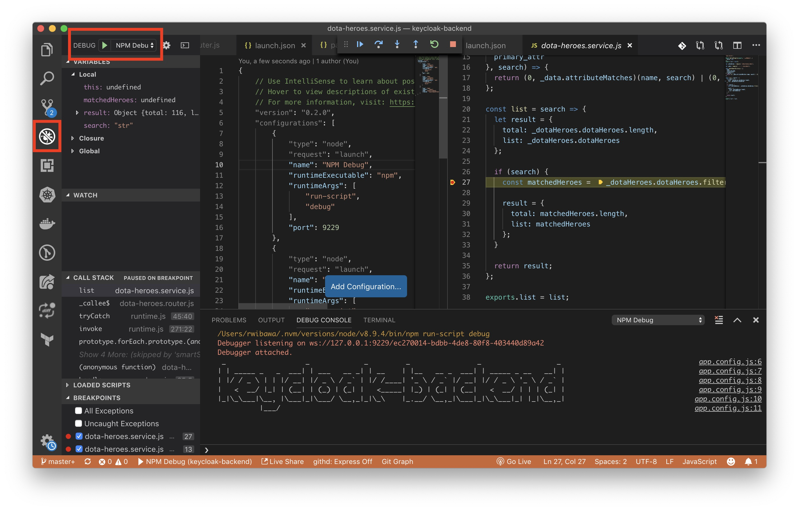

# keycloak-backend
* [BABEL Guide](https://babeljs.io/docs/en/usage)

## 1. Start
```bash
$ npm i
$ npx babel-node --presets @babel/preset-env -- src/app.js

# or
$ npm start

> keycloak-backend@1.0.0 start /Users/rwibawa/Documents/workspace_ng/keycloak01/keycloak-backend
> nodemon src/app.js --exec babel-node --presets @babel/preset-env

[nodemon] 1.19.4
[nodemon] to restart at any time, enter `rs`
[nodemon] watching dir(s): src/**/*
[nodemon] watching extensions: js
[nodemon] starting `babel-node src/app.js --presets @babel/preset-env`
 _                   _             _         _                _                  _ 
| | _____ _   _  ___| | ___   __ _| | __    | |__   __ _  ___| | _____ _ __   __| |
| |/ / _ \ | | |/ __| |/ _ \ / _` | |/ /____| '_ \ / _` |/ __| |/ / _ \ '_ \ / _` |
|   <  __/ |_| | (__| | (_) | (_| |   <_____| |_) | (_| | (__|   <  __/ | | | (_| |
|_|\_\___|\__, |\___|_|\___/ \__,_|_|\_\    |_.__/ \__,_|\___|_|\_\___|_| |_|\__,_|
          |___/                                                                    

2019-10-22T20:50:03.438Z info: Keycloak Backend Initialized on Port 3000

2019-10-22T20:50:03.439Z info: For a complete list of API services, visit: http://localhost:3000/api/docs

2019-10-22T20:50:03.439Z info: ---------------

2019-10-22T20:50:03.918Z info: Router initialization is complete. Total of loaded routers: 1
```

### Note:
In order to try out the swagger api documentation at [http://localhost:3000/api/docs](http://localhost:3000/api/docs),
comment out the security part in `src/app.js` (line 25):
```js
24: // Security -> Keycloak
25: //initKeycloak(app);
```

## 2. Build and Run
```bash
# Build
$ ./node_modules/.bin/babel src --out-dir dist
# or
$ npm run build

# Run
$ node dist/app.js
# or
$ npm run serve
```

## 3. Setup
```bash
$ npm init
$ npm install --save-dev @babel/core @babel/cli @babel/preset-env @babel/node
$ npm i express cors
$ npm i winston file-matcher
$ npm i -S swagger-jsdoc swagger-ui-express
$ npm i -D nodemon
$ npm i -S express-session keycloak-connect

$ mkdir src
$ mkdir src/core
$ mkdir src/core/config

$ vi src/core/config/log.config.js
$ vi src/core/config/app.config.js
$ vi src/app.js
$ vi .babelrc
```

## 4. VSCode Debugger
* Click Debugger
* Select **NPM Debug** from the drop-down list
* Click **Run** icon


### [Debugger Setup](https://code.visualstudio.com/docs/nodejs/nodejs-debugging)
1. Click Debugger
2. Select **Add Configuration..** from the drop-down list. It will create `.vscode/launch.json` config file.
3. Add this to the *configurations* section:
```json
{
    "type": "node",
    "request": "launch",
    "name": "NPM Debug",
    "runtimeExecutable": "npm",
    "runtimeArgs": [
        "run-script",
        "debug"
    ],
    "port": 9229
}
```
4. Add this script in the *scripts* section of `package.json`:
```json
"scripts": {
    "debug": "node_modules/.bin/nodemon src/app.js --exec babel-node --presets @babel/preset-env --nolazy --inspect-brk=9229 dist/app.js"
}
```